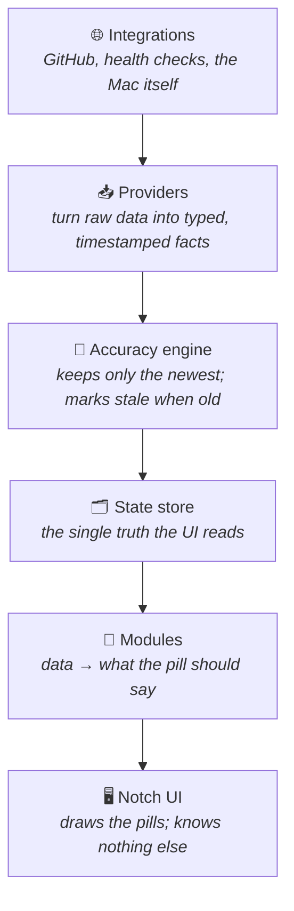

# How Perch is built

A quick tour of how the app is put together — enough to find your way around
and add things, without drowning in detail.

## The one idea

Perch shows small, glanceable **signals** in the notch (a build status, a clock,
later your PRs and deploys). Each signal is a **module**. A module has one job:
*produce some data over time, and say what its pill should look like.* It does
**not** know how it's drawn or where its data is stored.

Everything else exists to serve that: get data in, keep it honest, put it on
screen.

## The flow

Data moves in one direction — up. Nothing reaches past its neighbour.



Read it bottom-up if you like: the **UI** just draws whatever the **module**
hands it; the module gets its data from the **store**; the store only ever holds
what the **accuracy engine** approved; the engine gets facts from **providers**;
providers talk to the outside world.

Because the arrows only point one way, you can add a new signal, or swap how
things look, without disturbing the rest.

## Two promises the code keeps

**1. Nothing is tangled.**
A module returns a plain description of its pill (`text`, an icon, a colour like
"good" or "critical") — never actual UI code. The UI never sees a module's
internals. So adding GitHub support is *one new module*; no other file changes.

**2. It never lies.**
Every value carries how much we trust it: `live`, `computing`, `stale`,
`unknown`, or `error`. The accuracy engine accepts a new value **only if it's
newer** than what we already have, so a late or repeated message can't rewind
the truth. If a value gets old, the pill dims and shows "2m" — it never shows a
confident, wrong green.

## Where things live

```
Sources/
  PerchCore/        the shared words: Slot, Freshness, Snapshot, Tint
  PerchModuleKit/   the module contract (the SDK you write modules against)
  PerchSync/        the accuracy engine (VersionedStore)
  PerchModules/     the actual modules: Clock, and a fake Build for now
  PerchNotchUI/     the notch window + how a pill is drawn
  PerchApp/         the glue: which module goes in which slot
Tests/              proof the accuracy rules hold
```

## Adding a new signal (the whole recipe)

1. Write a type that conforms to `NotchModule` in `PerchModules/`.
2. Give it an `id`, the slots it fits, a stream of data, and a `face(for:)` that
   says how the pill looks.
3. Register it in `PerchApp` and point a slot at it.

That's it. The notch, the accuracy engine, and every other module stay exactly
as they were.

---

Want the deeper version — the full reasoning, the GitHub accuracy strategy, the
roadmap? That lives in the product architecture plan; this file is just the map.
